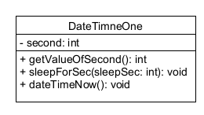
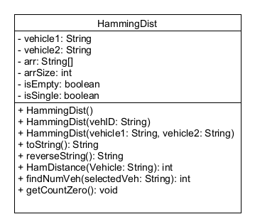

Project 1: **VANET Data Manipulation**

Project description pdf is on Canvas. Code submission is on Zybook and Github.

*Plagiarism* will not be tolerated under any circumstances. Participating students will be penalized depending on the degree of plagiarism. It includes **“No-code”** sharing among the students. It can lead to academic misconduct reporting to the authority if identical code is found among the students.

##DateTimeOne class
---
- getValueOfSecond(): get the value of time in second
- sleepForSec(int sleepSec): stop executing the program in specifed time
- dateTimeNow() print out the current date/time with format **Current Date/Time: MM/dd/YYYY hh:mm a**

##HammingDist
---
- HammingDist(): when this constructor is created in main, the prompt **The inputs are empty.** will be printed out.
- HammingDist(String vehID): when this constructor is created in main, the prompt **The second vehicle is missing.**.
- HammingDist(String vehicle1, String vehicle2): read the data file in __vanetp1data.txt__ then put third column which is __VehicleID__ in data to 
the array with the capacity about 10 to 20. When extracting the vehicleID, convert the vehicleID to uppercase letter.
If capacity of array is full then expand it.
- reverseString(): return the second input in reverse order if the second input is same as the first input.
- HamDistance(String Vehicle): return the hamming distance between the given vehicleID with the word **VEH00**.
- findNumVeh(String selectedVeh): return the number of vehicleID in data file that have the same Hamming distance 
with the Hamming distance between the selectedVeh and VEH00. Notice that the hamming distance of the vehicleID in data file 
is calculated by comparing each vehicleID in data set to selectedVeh.
- getCountZero(): return the nubmer of vehicleID in data file which ended with zero.
- toString(): return the prompts like sample output when print the object.
